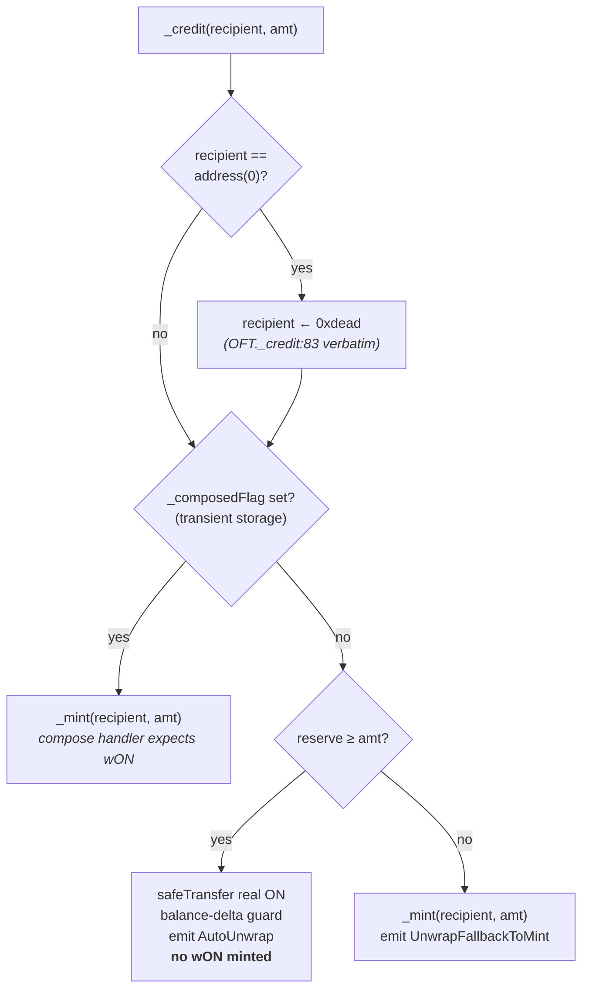

# ON Bridge Architecture (LayerZero V2)

How `ONOFTAdapter` (BSC) and `WrappedON` (Ethereum) plug into the LayerZero V2
messaging stack. Solution 3 from the design doc: BSC holds the canonical supply
locked in an OFT adapter; Ethereum gets a fresh mintable wrapper (`wON`) whose
auto-unwrap path uses an internal reserve of pre-existing ETH-side ON.

---

## High-level architecture

```mermaid
flowchart LR
    subgraph BSC["BSC — canonical, locked"]
        direction TB
        ONBSC["ON token<br/>0x0e4F…1D48<br/><i>immutable, lossless</i>"]
        ADAPTER["ONOFTAdapter<br/>OFT · owner = multisig<br/>· FoT balance-delta guard<br/>· _credit inherited from OFTAdapter<br/>· RateLimiter (outbound)"]
        EPBSC["Endpoint V2<br/>0x1a44…728c<br/>EID 30102"]
        ONBSC <-->|"transferFrom (lock)<br/>transfer (unlock)"| ADAPTER
        ADAPTER <-->|"send / lzReceive"| EPBSC
    end

    subgraph LZ["LayerZero off-chain"]
        direction TB
        MSGLIB["MessageLib (ULN302)<br/>packets · fees · verification"]
        DVN1["DVN<br/><b>LayerZero Labs</b>"]
        DVN2["DVN<br/><b>Google</b><br/><i>canonicalName</i>"]
        EXEC["Executor<br/>pays dst gas, calls lzReceive<br/>enforced options:<br/>BSC-in 250k · ETH-in 300k<br/>(msgType 1 and 2)"]
        MSGLIB --> DVN1
        MSGLIB --> DVN2
        DVN1 -->|attest payload hash| EXEC
        DVN2 -->|attest payload hash| EXEC
    end

    subgraph ETH["Ethereum — wrapped, mintable"]
        direction TB
        EPETH["Endpoint V2<br/>0x1a44…728c<br/>EID 30101"]
        WON["WrappedON (wON)<br/>OFT · owner = multisig<br/>· auto-unwrap _credit<br/>· upstream 0 → 0xdead redirect<br/>· RateLimiter (outbound)"]
        ONETH["ON token (legacy)<br/>0x33f6…B59d"]
        RESERVE[("RESERVE<br/>real ON held<br/>inside WrappedON")]
        EPETH <-->|"send / lzReceive"| WON
        WON -->|"auto-unwrap"| ONETH
        ONETH -->|"wrap / seedReserve"| RESERVE
        RESERVE -->|"unwrap"| ONETH
    end

    EPBSC <==>|"BSC→ETH 30 confs (~90s)<br/>ETH→BSC 15 confs (~3 min)"| MSGLIB
    EXEC <==> EPETH
    EXEC <==> EPBSC
```



---

## Component reference

| Component | Chain | Address | Role |
|---|---|---|---|
| ON token (canonical) | BSC | `0x0e4F…1D48` | Existing token, locked by adapter |
| `ONOFTAdapter` | BSC | (deploy) | OFT adapter, owner = multisig |
| ON token (legacy) | ETH | `0x33f6…B59d` | Existing token, held as reserve |
| `WrappedON` (wON) | ETH | (deploy) | Mintable OFT, owner = multisig |
| Endpoint V2 | both | `0x1a44…728c` | LayerZero entry point |
| DVNs | off-chain | n/a | `LayerZero Labs` + `Google` (2 required, 0 optional) |
| Executor | off-chain | n/a | Calls `lzReceive` on destination |

EIDs: `30101` Ethereum, `30102` BSC.

---

## Outbound message lifecycle (BSC → ETH plain `SEND`)

```mermaid
sequenceDiagram
    autonumber
    actor User
    participant ONBSC as BSC ON token
    participant Adapter as ONOFTAdapter (BSC)
    participant EPBSC as Endpoint V2 (BSC)
    participant DVN as DVNs<br/>(LayerZero Labs + Google)
    participant Exec as Executor
    participant EPETH as Endpoint V2 (ETH)
    participant WON as WrappedON (ETH)
    participant ONETH as ETH ON token

    User->>ONBSC: approve(adapter, amt)
    User->>Adapter: send(dstEid=30101, to, amt) + native fee
    Note over Adapter: _debit:<br/>· transferFrom(user → adapter, amt)<br/>· balance-delta guard rejects FoT<br/>RateLimiter:<br/>· consume outbound bucket for dstEid<br/>· revert here on overflow — funds safe
    Adapter->>EPBSC: endpoint.send(packet, fee)
    EPBSC-->>DVN: emit PacketSent

    Note over DVN: wait 30 BSC confirmations,<br/>each DVN signs payload hash<br/>against destination ULN
    DVN->>EPETH: verify(packetHeader, payloadHash)

    Note over Exec: detects DVN quorum
    Exec->>EPETH: lzReceive(origin, guid, message)<br/>(300k gas, enforced)
    EPETH->>WON: _lzReceive → _credit(to, amt)
    Note over WON: if to == address(0): to ← 0xdead<br/>(upstream OFT redirect; matches OFT._credit:83)
    alt composed (transient flag set)
        Note over WON: preserve compose semantics
        WON->>WON: _mint(to, amt)
    else reserve ≥ amt
        WON->>ONETH: safeTransfer(to, amt)
        Note over WON: no wON minted<br/>(self-transfer no-op reverts via balance-delta guard)
    else reserve < amt
        WON->>WON: _mint(to, amt)
        Note over WON: emit UnwrapFallbackToMint
    end
```

The reverse direction (ETH → BSC) is the mirror: `WrappedON.send()` burns wON
(rate-limited outbound), 15 ETH confirmations, then `ONOFTAdapter._credit`
unlocks real ON to the recipient. `ONOFTAdapter` does NOT override `_credit`
— inbound credit is `OFTAdapter._credit` verbatim (`innerToken.safeTransfer`).
`address(0)` reverts via OZ ERC20; `address(this)` is a silent self-transfer
no-op (operator obligation; see SECURITY.md M4).

---

## `WrappedON._credit` decision tree



`ONOFTAdapter._credit` is **not overridden** — inbound credit is
`OFTAdapter._credit` verbatim (`innerToken.safeTransfer(_to, _amountLD)`).
`address(0)` reverts via OZ ERC20; `address(this)` is a silent self-transfer
no-op (operator obligation; see SECURITY.md M4 for the rationale on matching
upstream rather than guarding on-chain).

---

## Invariants the diagrams reflect

- **Conservation.** At rest (no in-flight messages), every wON in circulation
  is backed 1:1 by real ON held either in `ONOFTAdapter` on BSC (for wON that
  arrived across the bridge) or in the ETH-side reserve (for wON minted via
  `wrap`). `seedReserve` donations add reserve without minting wON, so they
  appear as excess on the ETH side — a one-way treasury subsidy redeemable
  via auto-unwrap or `unwrap` to any wON holder, not just the donor.
- **Outbound-only throttle.** `RateLimiter` is checked in `_debit`, never in
  `_credit`. Throttling inbound would brick already-debited deliveries; the
  source-side limit is the only safe enforcement point. `RateLimitExceeded`
  reverts in the `send` call before any LayerZero plumbing engages, so the
  user keeps their funds.
- **Auto-unwrap is best-effort.** Plain BSC→ETH messages prefer real ON when
  `reserve ≥ amt`, fall back to wON otherwise. Composed messages always mint
  wON to keep `amountReceivedLD` consistent with what the compose handler
  expects to manipulate.
- **Bad-recipient handling matches upstream.** Neither contract guards
  bad recipients on-chain — both inherit the upstream LayerZero behaviour.
  `WrappedON` applies upstream `OFT._credit:83`'s `address(0) → 0xdead`
  redirect verbatim, then runs the normal branches (auto-unwrap drains
  reserve to `0xdead`; mints land at `0xdead`). `ONOFTAdapter` has no
  `_credit` override at all — `address(0)` reverts via OZ ERC20,
  `address(this)` is a silent self-transfer no-op. Both `address(0)` and
  `address(this)` are operator obligations: monitor for misaddressed
  inbound sends off-chain. See SECURITY.md M4 for the iteration history
  (redirect → revert → match-upstream) and the rationale.

See [SECURITY.md](./SECURITY.md) for the audit findings each of these
behaviours traces back to.
